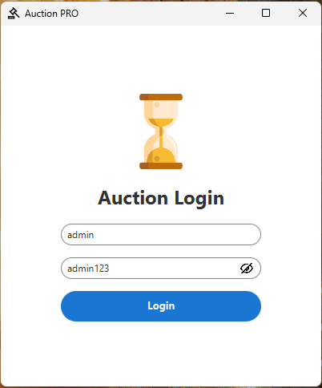
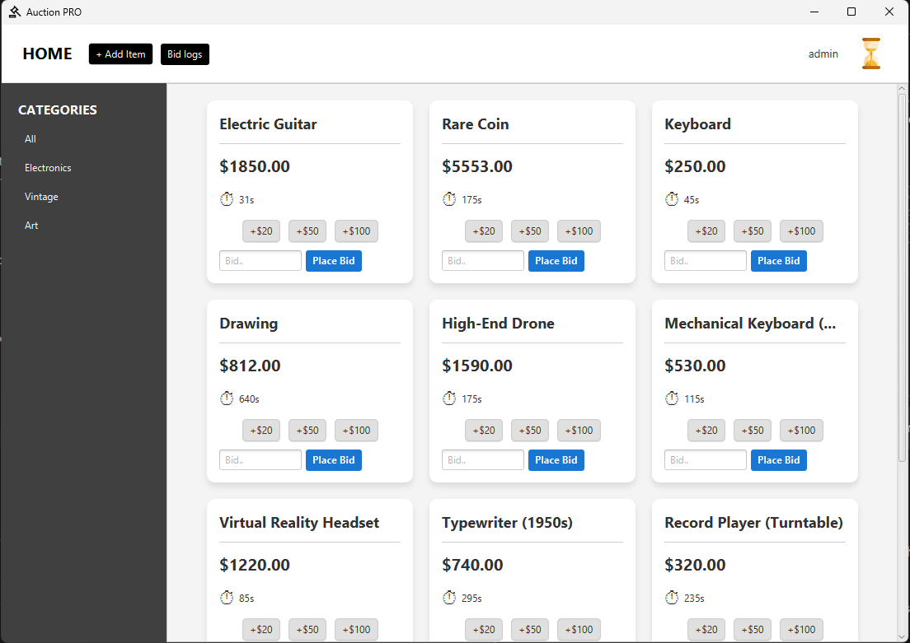
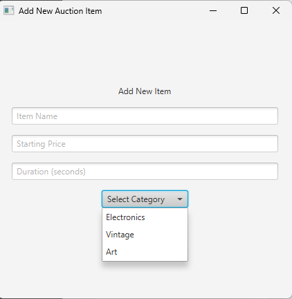

# Auction PRO ⏱️

Auction Pro is a professional-grade JavaFX desktop application that simulates a real-time auction environment. The project follows the Model-View-Controller (MVC) pattern and utilizes JDBC for persistent data storage with MySQL.

## 🚀 Key Features:

* **Role-Based Access Control (RBAC):** Separate views and permissions for Admin and User accounts.
* **Real-Time Auction Simulation:** Individual background daemon threads manage independent countdown timers for every auction item.
* **Transactional Bidding:** Supports manual input and "Quick Bid" buttons with instant database synchronization and bid logging.
* **Dynamic UI Feedback:** Features a "pulse" effect on price labels and category-based filtering for a smooth user experience.
* **Admin Audit Trail:** A dedicated log viewer for administrators to monitor all bidding activity across the system.

## 🛠️ Technical Stack:

* **Language:** Java 21
* **Build Tool:** Maven
* **UI Framework:** JavaFX
* **Database:** MySQL via JDBC

## 🔧 Getting Started

### 1. Database Setup
* Run the provided `script.sql` in your MySQL environment to create the `AuctionSimulation` database and required tables.
* The script includes default credentials: `admin/admin123` and `user/user123`.

### 2. Configure Credentials
* Open `com.auction.database.DatabaseManager.java`.
* Update the `DB_URL`, `USER`, and `PASS` variables to match your local MySQL settings.

### 3. Build & Run
* Open the project in IntelliJ IDEA.
* Click **"Load Maven Project"** to download all dependencies (JavaFX, MySQL Connector) automatically.
* Run the `Main.java` class to start the application.

## 📸 Dashboard Preview:
*  Login Dashboard!
*  Main Dashboard
*  Bid Logs Dialog
*  Add Item Dialog
